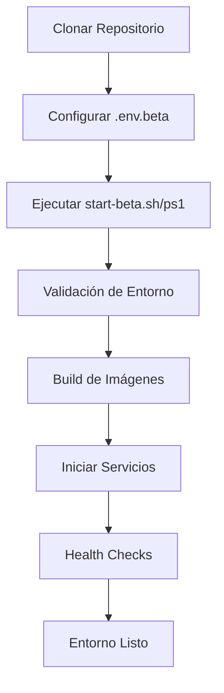

# StreetCore BETA - Docker Files Overview

## Archivos Creados para Docker/BETA

Este documento lista todos los archivos creados para el entorno Docker BETA.

---

## Configuración Principal

### Docker Compose

| Archivo | Descripción |
|---------|-------------|
| `docker-compose.yml` | Configuración principal para BETA/Production |
| `docker-compose.dev.yml` | Override para desarrollo local con hot reload |

### Dockerfiles

| Archivo | Descripción |
|---------|-------------|
| `backend/Dockerfile` | Imagen optimizada del backend Go (multi-stage) |
| `backend/Dockerfile.dev` | Imagen del backend con Air (hot reload) |
| `street_core/Dockerfile` | Imagen optimizada del frontend Flutter (multi-stage) |
| `street_core/Dockerfile.dev` | Imagen del frontend con hot reload |

### Docker Ignore

| Archivo | Descripción |
|---------|-------------|
| `.dockerignore` | Exclusiones raíz |
| `backend/.dockerignore` | Exclusiones backend (tests, docs, logs) |
| `street_core/.dockerignore` | Exclusiones frontend (platforms, tests) |

---

## Configuración Nginx (Frontend)

| Archivo | Descripción |
|---------|-------------|
| `street_core/nginx.conf` | Configuración principal de Nginx |
| `street_core/cloudflare.conf` | Reglas optimizadas para Cloudflare CDN |

**Características**:
- Headers de seguridad (CSP, X-Frame-Options, etc.)
- Cache optimizado por tipo de archivo
- Real IP restoration para Cloudflare
- SPA routing para Flutter

---

## Variables de Entorno

| Archivo | Descripción |
|---------|-------------|
| `.env.beta` | Configuración para entorno BETA |
| `.env` | Generado automáticamente desde `.env.beta` |

**Variables críticas**:
- `JWT_SECRET` - Generar con `openssl rand -hex 32`
- `OAUTH_ENCRYPTION_KEY` - Generar con `openssl rand -hex 32`
- `ADMIN_PASSWORD` - Cambiar por uno seguro
- `MONGO_ROOT_PASSWORD` - Contraseña MongoDB root
- `BASE_URL` / `API_URL` - Dominios de producción

---

## Scripts de Gestión

### Linux/macOS (Bash)

| Archivo | Descripción | Uso |
|---------|-------------|-----|
| `start-beta.sh` | Inicia el entorno completo | `./start-beta.sh` |
| `stop-beta.sh` | Detiene servicios | `./stop-beta.sh` |
| `reset-beta.sh` | Resetea datos (DESTRUCTIVO) | `./reset-beta.sh` |

### Windows (PowerShell)

| Archivo | Descripción | Uso |
|---------|-------------|-----|
| `start-beta.ps1` | Inicia el entorno completo | `.\start-beta.ps1` |
| `stop-beta.ps1` | Detiene servicios | `.\stop-beta.ps1` |
| `reset-beta.ps1` | Resetea datos (DESTRUCTIVO) | `.\reset-beta.ps1` |

**Permisos necesarios** (Linux/macOS):
```bash
chmod +x *.sh
```

---

## Scripts de Validación

| Archivo | Descripción |
|---------|-------------|
| `scripts/validate-env.sh` | Valida configuración antes de iniciar (Linux/macOS) |
| `scripts/validate-env.ps1` | Valida configuración antes de iniciar (Windows) |

**Se ejecutan automáticamente** en `start-beta.*` scripts.

**Validaciones**:
- Archivo `.env.beta` existe
- Variables críticas están configuradas
- JWT_SECRET tiene longitud mínima (32 chars)
- OAUTH_ENCRYPTION_KEY válida
- Docker instalado y corriendo
- Puertos disponibles (80, 3000, 27017)

---

## Scripts de MongoDB

| Archivo | Descripción |
|---------|-------------|
| `scripts/docker-init/01-init-db.js` | Inicialización automática de MongoDB |

**Ejecuta**:
1. Crea base de datos `streetcore`
2. Crea usuario de aplicación `streetcore_app`
3. Crea colecciones iniciales
4. Crea índices básicos (incluidos TTL indexes)

---

## Makefile

| Archivo | Descripción |
|---------|-------------|
| `Makefile` | Comandos rápidos para gestión del entorno |

**Comandos principales**:
```bash
make start          # Iniciar servicios
make stop           # Detener servicios
make restart        # Reiniciar servicios
make logs           # Ver logs
make status         # Estado de servicios
make health         # Health checks
make backup         # Backup completo
make shell-backend  # Shell en backend
make shell-mongodb  # Shell en MongoDB
```

**Ver todos**: `make help`

---

## Documentación

| Archivo | Descripción |
|---------|-------------|
| `BETA-DEPLOYMENT.md` | Guía completa de despliegue BETA (19 páginas) |
| `DOCKER-QUICKSTART.md` | Guía rápida de inicio (5 minutos) |
| `DOCKER-FILES.md` | Este archivo (overview de archivos) |

---

## Configuración de Desarrollo

| Archivo | Descripción |
|---------|-------------|
| `backend/.air.toml` | Configuración de Air para hot reload (Go) |

**Uso**:
```bash
docker-compose -f docker-compose.yml -f docker-compose.dev.yml up
```

---

## Estructura de Directorios

```
C:\src\street-core\
│
├── docker-compose.yml              # Configuración principal
├── docker-compose.dev.yml          # Override para desarrollo
├── .dockerignore                   # Exclusiones raíz
├── .env.beta                       # Variables de entorno BETA
├── Makefile                        # Comandos rápidos
│
├── backend/
│   ├── Dockerfile                  # Imagen producción
│   ├── Dockerfile.dev              # Imagen desarrollo
│   ├── .dockerignore               # Exclusiones backend
│   └── .air.toml                   # Configuración Air
│
├── street_core/
│   ├── Dockerfile                  # Imagen producción
│   ├── Dockerfile.dev              # Imagen desarrollo
│   ├── .dockerignore               # Exclusiones frontend
│   ├── nginx.conf                  # Configuración Nginx
│   └── cloudflare.conf             # Reglas Cloudflare
│
├── scripts/
│   ├── docker-init/
│   │   └── 01-init-db.js          # Inicialización MongoDB
│   ├── validate-env.sh             # Validación (Linux/macOS)
│   └── validate-env.ps1            # Validación (Windows)
│
├── backups/
│   ├── mongodb/                    # Backups de base de datos
│   └── uploads/                    # Backups de archivos
│
├── start-beta.sh                   # Iniciar (Linux/macOS)
├── stop-beta.sh                    # Detener (Linux/macOS)
├── reset-beta.sh                   # Resetear (Linux/macOS)
├── start-beta.ps1                  # Iniciar (Windows)
├── stop-beta.ps1                   # Detener (Windows)
├── reset-beta.ps1                  # Resetear (Windows)
│
├── BETA-DEPLOYMENT.md              # Guía completa
├── DOCKER-QUICKSTART.md            # Guía rápida
└── DOCKER-FILES.md                 # Este archivo
```

---

## Volúmenes Docker Persistentes

| Volumen | Contenido | Ubicación |
|---------|-----------|-----------|
| `streetcore-mongodb-data-beta` | Base de datos MongoDB | `/data/db` |
| `streetcore-mongodb-config-beta` | Configuración MongoDB | `/data/configdb` |
| `streetcore-backend-uploads-beta` | Archivos subidos | `/app/uploads` |
| `streetcore-backend-logs-beta` | Logs del backend | `/app/logs` |

**Ver volúmenes**:
```bash
docker volume ls | grep streetcore
```

**Eliminar volúmenes** (DESTRUCTIVO):
```bash
docker-compose down -v
```

---

## Red Docker

| Red | Tipo | Subnet |
|-----|------|--------|
| `streetcore-network` | bridge | 172.20.0.0/16 |

**Servicios en la red**:
- `mongodb` - MongoDB 7.0
- `backend` - Go/Gin API
- `frontend` - Flutter Web + Nginx

**Resolución DNS interna**: Los servicios se comunican por nombre (`mongodb`, `backend`, `frontend`).

---

## Puertos Expuestos

| Servicio | Puerto Host | Puerto Contenedor | Descripción |
|----------|-------------|-------------------|-------------|
| Frontend | 80 | 80 | Nginx + Flutter Web |
| Backend | 3000 | 3000 | Go/Gin API |
| MongoDB | 27017 | 27017 | MongoDB Database |

**Cambiar puertos**: Editar `docker-compose.yml` en sección `ports`.

---

## Health Checks Configurados

Todos los servicios tienen health checks:

| Servicio | Comando | Intervalo | Timeout |
|----------|---------|-----------|---------|
| MongoDB | `mongosh ping` | 10s | 5s |
| Backend | `wget /health` | 30s | 10s |
| Frontend | `wget /health` | 30s | 10s |

**Ver estado**:
```bash
docker inspect --format='{{.State.Health.Status}}' <container>
```

---

## Cloudflare Integration

### Headers Configurados

**Security**:
- X-Frame-Options: SAMEORIGIN
- X-Content-Type-Options: nosniff
- X-XSS-Protection: 1; mode=block
- Content-Security-Policy: Configurado
- Referrer-Policy: strict-origin-when-cross-origin

**Cache**:
- HTML: `no-cache` (siempre fresco)
- Assets (JS/CSS/IMG): `1 year` (immutable)
- API: `bypass` (no cachear)

**Real IP**:
- Restaura IP real del cliente desde Cloudflare
- Incluye todos los rangos IP de Cloudflare

---

## Workflow de Despliegue



**Tiempo estimado**: 5-10 minutos (primera vez).

---

## Checklist de Despliegue

- [ ] Docker instalado y corriendo
- [ ] Copiar `.env.beta` y configurar
- [ ] Generar `JWT_SECRET` con `openssl rand -hex 32`
- [ ] Generar `OAUTH_ENCRYPTION_KEY` con `openssl rand -hex 32`
- [ ] Cambiar `ADMIN_PASSWORD` por uno seguro
- [ ] Configurar dominios (`BASE_URL`, `API_URL`)
- [ ] Ejecutar `start-beta.sh` o `start-beta.ps1`
- [ ] Verificar health checks (`make health`)
- [ ] Acceder a frontend en http://localhost:80
- [ ] Login admin con credenciales configuradas
- [ ] Configurar DNS en Cloudflare (producción)
- [ ] Configurar SSL/TLS en Cloudflare (producción)

---

## Comandos Útiles de Docker

### Ver logs
```bash
docker-compose logs -f [service]
```

### Estado de servicios
```bash
docker-compose ps
```

### Reiniciar un servicio
```bash
docker-compose restart [service]
```

### Rebuild sin cache
```bash
docker-compose build --no-cache [service]
```

### Acceder a shell
```bash
docker exec -it [container] sh
```

### Ver uso de recursos
```bash
docker stats
```

### Limpiar sistema
```bash
docker system prune -a
```

---

## Troubleshooting

### Puerto ocupado
Cambiar puerto en `docker-compose.yml` o liberar puerto ocupado.

### Contenedor no inicia
```bash
docker-compose logs [service]
docker inspect [container]
```

### MongoDB no conecta
Verificar `MONGO_URI` en variables de entorno. Debe usar `mongodb://mongodb:27017` (no `localhost`).

### Health check falla
Esperar 60 segundos, verificar logs, reintentar.

### Volúmenes corruptos
```bash
./reset-beta.sh  # DESTRUCTIVO: Elimina todos los datos
```

---

## Migración a Producción

Cuando BETA sea estable:

1. Cambiar `ENV=production` en `.env.beta`
2. Cambiar `TESTING_MODE=false`
3. Configurar SSL/TLS en Cloudflare (Full Strict)
4. Habilitar rate limiting estricto
5. Configurar S3 storage (opcional)
6. Configurar backups automáticos
7. Configurar monitoreo (Prometheus/Grafana)

---

## Soporte y Referencias

- **Docker**: https://docs.docker.com/
- **Docker Compose**: https://docs.docker.com/compose/
- **Cloudflare**: https://developers.cloudflare.com/
- **MongoDB**: https://www.mongodb.com/docs/
- **Nginx**: https://nginx.org/en/docs/

---

**Última actualización**: 2026-01-11
**Versión**: 0.2
**Entorno**: BETA (Staging)
